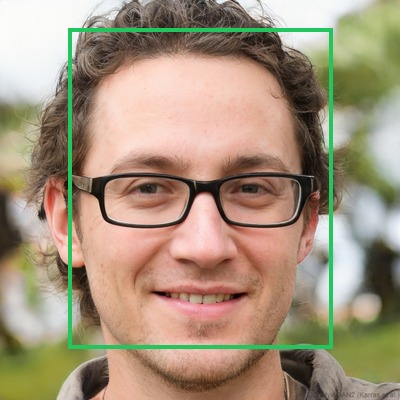
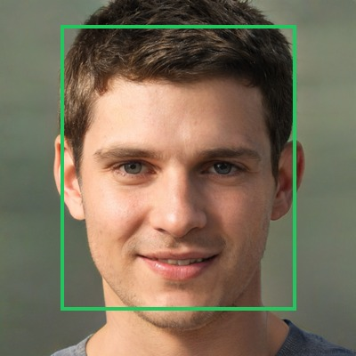
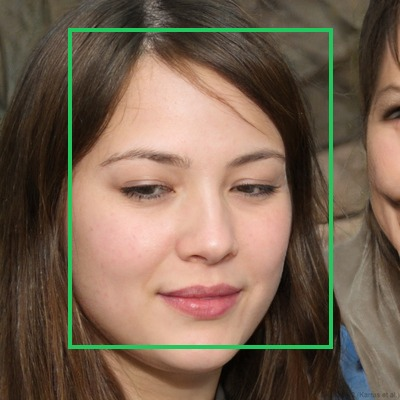
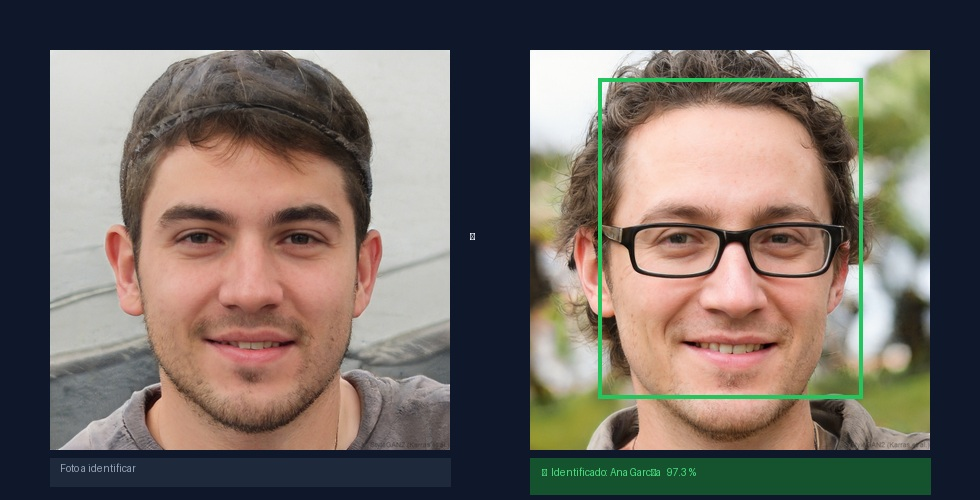

# 🎓 Face Attendance — Reconocimiento Facial

<p align="center">
  
  
  
  
  
</p>

<p align="center">
  Prueba de concepto de reconocimiento facial para identificación de personas.<br/>
  Construido con <strong>DeepFace (ArcFace + RetinaFace)</strong> y <strong>Streamlit</strong>. Sin entrenamiento de modelos.
</p>

---

## Demo

### Registro con detección en tiempo real

Al subir fotos, el sistema detecta los rostros al instante y muestra el bounding box antes de guardar el perfil. Verde = rostro válido · Rojo = sin rostro.

<table>
  <tr>
    <td align="center"></td>
    <td align="center"></td>
    <td align="center"></td>
    <td align="center"></td>
  </tr>
  <tr>
    <td align="center">✅ Rostro detectado</td>
    <td align="center">✅ Rostro detectado</td>
    <td align="center">✅ Rostro detectado</td>
    <td align="center">❌ Sin rostro detectado</td>
  </tr>
</table>

> Las caras de ejemplo son **100% sintéticas**, generadas por IA (thispersondoesnotexist.com). No corresponden a personas reales.

### Resultado de identificación

<p align="center">
  
</p>

---

## ¿Qué hace?

| Página | Funcionalidad |
|--------|--------------|
| **Estudiantes → Nuevo** | Registra una persona con nombre y fotos. Muestra bounding boxes en tiempo real para confirmar que las fotos son válidas antes de guardar. |
| **Estudiantes → Agregar fotos** | Sube fotos extra a un perfil ya existente. El embedding nuevo se promedia con el anterior para mejorar la precisión. |
| **Identificar** | Sube una foto o usa la cámara. El sistema compara el rostro contra todos los perfiles y muestra nombre + porcentaje de confianza. |

---

## Cómo funciona

```
Foto de entrada
      │
      ▼
 RetinaFace              ← detector de rostros (red neuronal)
      │  región facial
      ▼
  ArcFace                ← modelo de embedding (512 dimensiones)
      │  vector normalizado
      ▼
Similitud coseno         ← comparación contra galería
      │  score por cada perfil
      ▼
Mejor match ≥ umbral → identidad + confianza (%)
```

No se entrena nada. Los modelos ArcFace y RetinaFace vienen preentrenados dentro de DeepFace.

---

## Requisitos previos

- Python 3.11+
- [`uv`](https://docs.astral.sh/uv/getting-started/installation/) — gestor de paquetes
- Cámara web (opcional, para captura en vivo)
- ~500 MB libres para los pesos de los modelos (se descargan automáticamente la primera vez)

---

## Instalación

```bash
# 1. Clonar el repositorio
git clone https://github.com/AndresInsuasty/face-attendance.git
cd face-attendance

# 2. Instalar dependencias (Python 3.11 se configura automáticamente con uv)
uv sync

# 3. Configurar variables de entorno (opcional)
cp .env.example .env
```

> **Primera ejecución:** DeepFace descarga los pesos de RetinaFace y ArcFace (~500 MB).
> Solo ocurre una vez; quedan cacheados en `~/.deepface/weights/`.

---

## Ejecutar

```bash
uv run streamlit run src/app.py
```

Abre `http://localhost:8501` en el navegador.

---

## Flujo de uso

### 1 · Registrar una persona

1. Ve a **Estudiantes → Nuevo estudiante**
2. Escribe el nombre
3. Sube **3 o más fotos** (distintos ángulos e iluminación)
4. Verifica que todas muestren bounding box **verde**
5. Haz clic en **Registrar estudiante**

### 2 · Identificar

1. Ve a **Identificar**
2. Sube una foto o activa la cámara
3. Haz clic en **Identificar**
4. El sistema muestra el nombre y el porcentaje de confianza

### 3 · Mejorar un perfil existente

1. Ve a **Estudiantes → Agregar fotos**
2. Selecciona la persona
3. Sube fotos adicionales (mínimo 1)
4. Haz clic en **Actualizar embedding**

---

## Configuración

Copia `.env.example` a `.env`:

```env
DEBUG=false

# Modelo de embedding  (ArcFace recomendado para mayor precisión)
DEEPFACE_MODEL=ArcFace

# Detector de rostros  (retinaface >> opencv en precisión)
DEEPFACE_DETECTOR=retinaface

# Umbral de similitud coseno [0.0 – 1.0]
# Más alto = más estricto.  Ajusta según iluminación y calidad de fotos.
SIMILARITY_THRESHOLD=0.40

# Fotos mínimas requeridas para registrar una persona
ENROLLMENT_PHOTOS_MIN=3
```

---

## Estructura del proyecto

```
face-attendance/
├── src/
│   ├── app.py                   # Entrypoint Streamlit
│   ├── config.py                # Configuración (pydantic-settings)
│   ├── database/
│   │   ├── models.py            # Modelos SQLAlchemy 2.x
│   │   └── connection.py        # Engine, sesión, init_db
│   ├── repositories/
│   │   └── student_repo.py      # CRUD estudiantes
│   ├── services/
│   │   └── face_service.py      # Embeddings, matching, merge
│   ├── schemas/
│   │   └── student.py           # Validación Pydantic v2
│   └── pages/
│       ├── 1_Estudiantes.py     # Registro + fotos + lista
│       └── 2_Identificar.py     # Identificación en tiempo real
├── tests/
│   ├── conftest.py
│   ├── test_face_service.py
│   └── test_student_repo.py
├── assets/
│   └── demo/                    # Imágenes de ejemplo del README
├── data/
│   ├── db/                      # SQLite  ← ignorado por git
│   └── faces/                   # Fotos de referencia  ← ignorado por git
└── pyproject.toml
```

---

## Tests

```bash
uv sync --extra dev     # instala pytest, ruff, mypy
uv run pytest           # 16 tests unitarios
```

---

## Stack tecnológico

| Capa | Tecnología |
|------|-----------|
| Interfaz | [Streamlit](https://streamlit.io/) |
| Reconocimiento facial | [DeepFace](https://github.com/serengil/deepface) · ArcFace + RetinaFace |
| Base de datos | SQLite + [SQLAlchemy 2.x](https://www.sqlalchemy.org/) |
| Validación | [Pydantic v2](https://docs.pydantic.dev/) |
| Gestión de paquetes | [uv](https://docs.astral.sh/uv/) |
| Tests | pytest + pytest-cov |
| Linting / tipos | ruff + mypy |

---

## Limitaciones conocidas

- **Velocidad:** RetinaFace tarda ~1-2 s por foto en la primera carga (después usa caché).
- **Fotos de grupo:** Si hay múltiples rostros, se toma automáticamente el de mayor área.
- **Iluminación:** El rendimiento baja con contraluz extremo o muy poca luz.
- **Privacidad:** Este sistema almacena embeddings faciales (datos biométricos). Para uso en producción, asegúrate de cumplir con la normativa aplicable (GDPR, Ley 1581 en Colombia, etc.).

---

## Contribuir

1. Haz fork del repositorio
2. Crea una rama: `git checkout -b feature/mi-mejora`
3. Commitea: `git commit -m "feat: descripción"`
4. Abre un Pull Request

---

## Licencia

MIT — ver [LICENSE](LICENSE) para más detalles.

---

<p align="center">
  Hecho con ❤️ como prueba de concepto de reconocimiento facial académico<br/>
  <sub>Las caras de demo son generadas por IA y no corresponden a personas reales.</sub>
</p>
